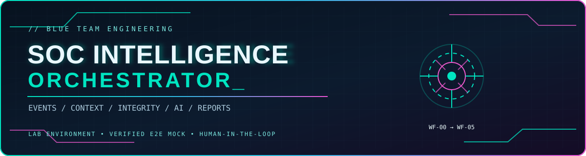
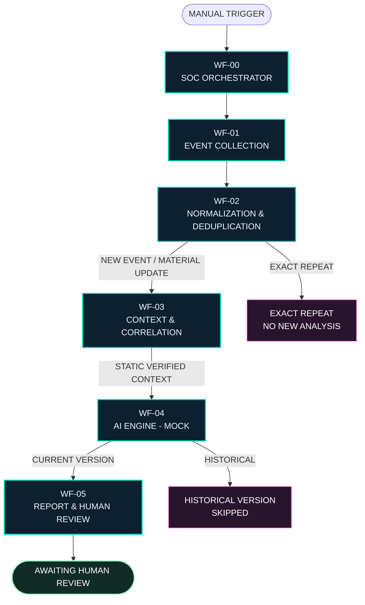
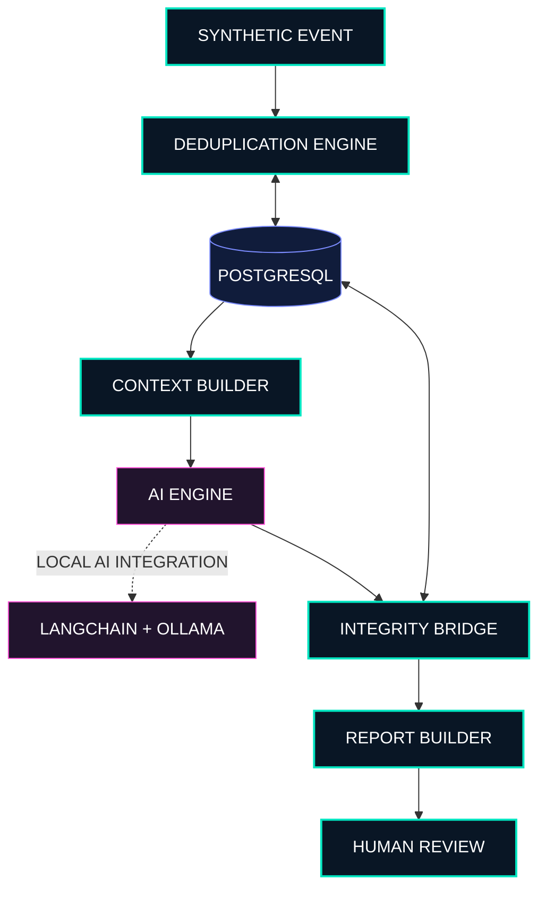
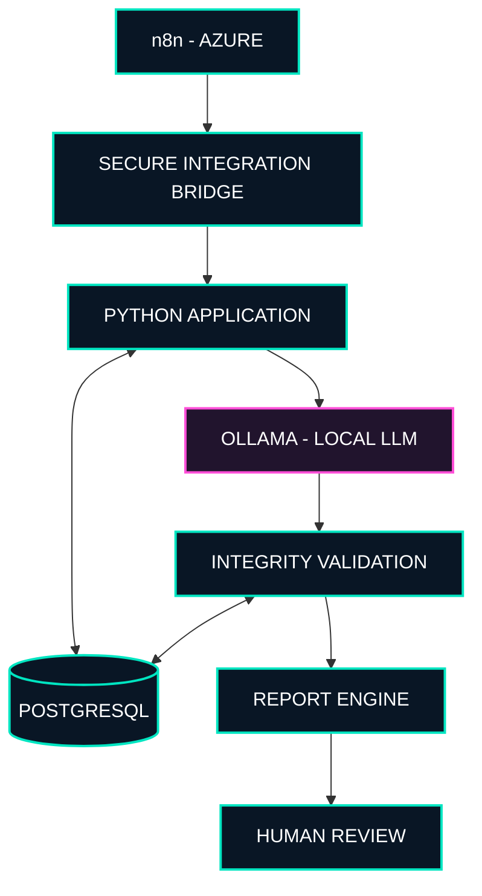

<p align="center">
  
</p>
 
<div align="center">

# ⚡ SOC INTELLIGENCE ORCHESTRATOR

### `AUTONOMOUS INTELLIGENCE · SOC AUTOMATION · BLUE TEAM`

**Threat Intelligence | Event Correlation | AI-Assisted Analysis | Human-in-the-Loop**

*Uma arquitetura modular de inteligência e automação para operações de segurança (SOC N1), desenvolvida com n8n, Python, PostgreSQL e inteligência artificial.*

---

[](workflows/SOC-INTELLIGENCE-ORCHESTRATOR-E2E-LAB.json)


<br>


<br>

`SOC // INTELLIGENCE // ORCHESTRATOR`

**ENGINEERED FOR DEFENSIVE AUTOMATION**

</div>

---

# ◈ 01. VISÃO GERAL

O **SOC Intelligence Orchestrator** é um projeto de engenharia de segurança e automação desenvolvido para organizar o processamento de eventos de segurança em uma arquitetura modular e inteligente.

Seu propósito é reduzir o retrabalho durante a triagem de um SOC N1, utilizando técnicas de normalização, deduplicação, correlação, versionamento investigativo e análise assistida por inteligência artificial.

O sistema foi projetado para preservar a rastreabilidade das informações desde a entrada do evento até a elaboração de um relatório técnico estruturado.

A arquitetura prioriza:

- Automação controlada.
- Separação de responsabilidades.
- Integridade e proveniência dos dados.
- Deduplicação de eventos.
- Controle de versões investigativas.
- Análise contextual.
- Persistência transacional.
- Revisão humana obrigatória.
- Segurança desde a concepção.

> [!IMPORTANT]
> **Escopo da versão publicada:** o workflow E2E homologado no n8n utiliza eventos sintéticos, contextos exportados e uma resposta de IA MOCK. A camada Python possui implementações independentes de persistência PostgreSQL, integridade analítica e integração local com Ollama. A conexão desses componentes ao E2E remoto ainda faz parte do roadmap.

---

# ◈ 02. PRINCÍPIOS DE ENGENHARIA

O projeto utiliza uma abordagem modular, incremental e orientada à validação de contratos.

| Princípio | Aplicação |
|:---|:---|
| **Contract-First** | Contratos JSON validados entre os workflows. |
| **Version-Aware** | Diferenciação entre versões históricas e vigentes. |
| **Deduplication-First** | Repetições exatas não iniciam novas análises. |
| **Integrity-by-Design** | Assinaturas para conteúdo, análise e identificação de resultados. |
| **Human-in-the-Loop** | Decisões operacionais permanecem sob controle humano. |
| **Safe-by-Default** | Execuções LAB, dados sintéticos e despacho operacional bloqueado. |
| **Modular Architecture** | Separação entre coleta, processamento, IA e relatórios. |

---

# ◈ 03. ARQUITETURA DO SISTEMA

## 3.1 Arquitetura E2E homologada — n8n LAB/MOCK

O sistema é composto por seis módulos principais, executados em um único workflow integrado.



### Homologação do fluxo

A primeira execução integrada foi realizada no **n8n hospedado na Azure**, utilizando um cenário de laboratório controlado.

| Indicador | Resultado |
|:---|:---|
| Workflows integrados | WF-00 até WF-05 |
| Total de nós | 20 |
| Conexões | 19 |
| Execução | Manual |
| Ambiente | LAB |
| Entrada | Dados sintéticos |
| Resultado final | `AWAITING_HUMAN_REVIEW` |
| Relatório HTML | Gerado |
| Aprovação automática | Desabilitada |
| Notificações operacionais | Desabilitadas |

## 3.2 Arquitetura da camada Python

Além dos workflows n8n, o repositório contém uma camada Python responsável pelas funcionalidades de persistência, processamento contextual, inteligência artificial, integridade e relatórios.



**Nota técnica:** esses componentes foram implementados e testados separadamente no laboratório local. A comunicação em tempo de execução entre o n8n remoto, PostgreSQL e Ollama ainda não integra a versão E2E publicada.

---

# ◈ 04. PIPELINE DE PROCESSAMENTO

## WF-00 — SOC Orchestrator

**Responsabilidade:** iniciar e controlar o processamento.

- Recebe a solicitação.
- Gera um identificador de execução.
- Valida o ambiente.
- Define os parâmetros de coleta.
- Inicia o percurso integrado.

**Modo atual:** despacho interno simulado.

## WF-01 — Event Collection

**Responsabilidade:** coleta e validação dos eventos.

- Recebe eventos sintéticos.
- Valida campos obrigatórios.
- Confere timestamps.
- Verifica entidades e evidências.
- Prepara os registros para normalização.

## WF-02 — Normalization & Deduplication

**Responsabilidade:** identificar a natureza de cada ocorrência.

| Classificação | Comportamento |
|:---|:---|
| `NEW_EVENT` | Identifica um novo evento e solicita análise. |
| `EXACT_REPEAT` | Reconhece repetição idêntica, sem nova análise. |
| `MATERIAL_UPDATE` | Identifica alterações relevantes e incrementa a versão. |

A deduplicação do E2E atual ocorre em memória durante a execução do workflow.

## WF-03 — Context & Correlation

**Responsabilidade:** organizar o contexto investigativo.

- Consolida informações do evento.
- Organiza indicadores.
- Identifica evidências relacionadas.
- Mantém a proveniência.
- Diferencia versões históricas e atuais.
- Determina elegibilidade para análise.

Na demonstração E2E, os contextos são provenientes de uma exportação estática previamente verificada no PostgreSQL do laboratório.

## WF-04 — AI Engine

**Responsabilidade:** preparar e validar a análise assistiva.

O módulo Python possui integração local com LangChain e Ollama.

No E2E n8n homologado, o WF-04 utiliza uma resposta MOCK previamente definida, validando sua correspondência com o contexto recebido.

O resultado contempla:

- Resumo da ocorrência.
- Avaliação assistiva.
- Identificação das evidências utilizadas.
- Limitações da análise.
- Recomendações para revisão humana.

## WF-05 — Report & Human Review

**Responsabilidade:** consolidar os resultados e produzir o relatório técnico.

- Valida o contrato do WF-04.
- Seleciona a versão investigativa vigente.
- Prepara o relatório HTML.
- Inclui referências das evidências.
- Preserva informações de rastreabilidade.
- Exige revisão humana.

O sistema não aprova automaticamente os resultados e não realiza ações operacionais.

---

# ◈ 05. CENÁRIO SINTÉTICO DE VALIDAÇÃO

Durante a homologação, foi utilizado o evento sintético `LAB-0001`.

O objetivo foi verificar se o sistema consegue distinguir uma repetição exata de uma atualização que contém informações relevantes.

| Entrada | Característica | Resultado |
|:---|:---|:---|
| `NEW_EVENT` | Severidade média e primeira evidência. | Versão 1 |
| `EXACT_REPEAT` | Mesmo evento, sem alterações. | Nenhuma nova análise |
| `MATERIAL_UPDATE` | Severidade alta e segunda evidência. | Versão 2 |

### Controle de versões

| Queue | Versão | Estado |
|:---|:---:|:---|
| 12 | 1 | `SKIPPED` |
| 13 | 2 | `ANALYSIS_COMPLETED` (MOCK) |

A versão histórica permanece preservada para fins de rastreabilidade, enquanto a versão atual é utilizada na preparação do relatório.

---

# ◈ 06. CONTRATO FINAL DO WF-05

A execução E2E homologada produziu um único resultado destinado à revisão humana.

<details>
<summary><strong>Visualizar exemplo do contrato JSON</strong></summary>

```json
{
  "schema_version": "1.0",
  "environment": "LAB",
  "processor": "WF-05",
  "integration_mode": "MOCK_SNAPSHOT",
  "report_status": "AWAITING_HUMAN_REVIEW",
  "source_event_id": "LAB-0001",
  "queue_id": 13,
  "investigation_version": 2,
  "historical_queue_id": 12,
  "real_ollama_call": false,
  "ready_for_operational_dispatch": false,
  "notification_sent": false,
  "human_review_required": true,
  "human_review_completed": false,
  "decision": {
    "eligible_for_human_review": true,
    "review_mode": "MOCK_ONLY",
    "automatically_approved": false,
    "operational_dispatch_allowed": false
  }
}
```

</details>

O resultado completo também contém o campo `html`, com o relatório técnico preparado para inspeção.

---

# ◈ 07. STACK TECNOLÓGICA

| Camada | Tecnologia | Finalidade |
|:---|:---|:---|
| Orquestração | n8n | Controle e execução dos workflows |
| Linguagem principal | Python | Implementação das regras e integrações |
| Processamento n8n | JavaScript | Validação e transformação de dados |
| Banco de dados | PostgreSQL 16 | Persistência e versionamento |
| Infraestrutura | Docker Compose | Ambiente local de laboratório |
| IA local | Ollama | Motor de inferência local |
| Framework de IA | LangChain | Integração com o modelo de linguagem |
| Modelo utilizado no LAB | `qwen3:4b-instruct` | Análise assistiva controlada |
| Relatórios | HTML / CSS | Apresentação dos resultados |
| Versionamento | Git / GitHub | Controle do código-fonte |
| Validação | Python / Node.js | Testes funcionais e de integração |

---

# ◈ 08. ESTRUTURA DO REPOSITÓRIO

```text
soc-intelligence-orchestrator/
│
├── database/
│   ├── schema.sql
│   └── 002_ai_analysis_integrity.sql
│
├── src/
│   │
│   ├── collector/
│   │   └── wf01_bridge.py
│   │
│   ├── dedup/
│   │   └── persistence.py
│   │
│   ├── context/
│   │   ├── context_builder.py
│   │   └── wf02_wf03_bridge.py
│   │
│   ├── ai_engine/
│   │   ├── engine.py
│   │   ├── cache.py
│   │   ├── integrity.py
│   │   ├── integrity_bridge.py
│   │   ├── integrity_persistence.py
│   │   └── persistent_bridge.py
│   │
│   └── reports/
│       ├── report_builder.py
│       ├── persistent_handoff.py
│       └── persistent_report.py
│
├── workflows/
│   ├── WF-00-SOC-Orchestrator.json
│   ├── WF-01-Coleta-de-Eventos.json
│   ├── WF-02-Normalizacao-e-Deduplicacao.json
│   ├── WF-03-Contexto-e-Correlacao.json
│   ├── WF-04-Motor-de-IA.json
│   ├── WF-05-Relatorios-e-Revisao-Humana.json
│   │
│   ├── INTEGRACAO-WF01-WF02-LAB.json
│   ├── INTEGRACAO-WF01-WF02-WF03-LAB.json
│   ├── INTEGRACAO-WF01-WF02-WF03-WF04-LAB.json
│   ├── INTEGRACAO-WF04-WF05-LAB.json
│   ├── INTEGRACAO-WF04-WF05-INTEGRIDADE-LAB.json
│   ├── INTEGRACAO-WF04-WF05-HTML-DINAMICO-LAB.json
│   │
│   └── SOC-INTELLIGENCE-ORCHESTRATOR-E2E-LAB.json
│
├── tests/
│   ├── fixtures/
│   ├── test_*.py
│   ├── test_*.js
│   └── export_*.py
│
├── reports/
│   └── LAB-0001/
│       └── SOC-LAB-0001-V2-MOCK.html
│
├── .env.example
├── .gitignore
├── docker-compose.yml
└── README.md
```

---

# ◈ 09. INTEGRIDADE E RASTREABILIDADE

A camada Python implementa mecanismos para preservar a consistência das análises realizadas no laboratório.

Entre os identificadores utilizados estão:

| Identificador | Finalidade |
|:---|:---|
| `content_signature` | Identificar o conteúdo associado à versão investigativa. |
| `analysis_signature` | Representar a assinatura da análise. |
| `result_key` | Identificar o resultado de maneira determinística. |

Os componentes de persistência também possuem testes relacionados a:

- Idempotência.
- Integridade transacional.
- Rollback.
- Concorrência.
- Validação de contratos.
- Rechecagem de registros persistidos.

**Limitação da versão atual:** a homologação remota no n8n utiliza um snapshot previamente validado. A rechecagem PostgreSQL em tempo real pertence à camada Python e ainda precisa ser conectada ao E2E da Azure.

---

# ◈ 10. COMO EXECUTAR O LABORATÓRIO

## 10.1 Clonar o repositório

```powershell
git clone https://github.com/Paula-Tech007/soc-intelligence-orchestrator.git

cd soc-intelligence-orchestrator
```

## 10.2 Criar o ambiente virtual

```powershell
python -m venv .venv

.\.venv\Scripts\Activate.ps1
```

## 10.3 Configurar o PostgreSQL

Copie o arquivo de exemplo:

```powershell
Copy-Item .env.example .env
```

Configure a variável `SOC_DB_PASSWORD` no arquivo `.env` com uma senha exclusiva do laboratório.

Em seguida:

```powershell
docker compose up -d

docker compose ps
```

O Docker Compose utiliza PostgreSQL 16 Alpine e publica a porta local `127.0.0.1:15432`.

> [!WARNING]
> O schema inicial é aplicado durante a criação de um novo volume. A migração `002_ai_analysis_integrity.sql` é mantida separadamente. Não execute migrações sobre bancos existentes sem revisar o estado e preparar um backup.

## 10.4 Executar testes

Exemplo de teste Python:

```powershell
$env:PYTHONPATH = (Get-Location).Path

python tests/test_report_builder.py
```

Exemplo de teste JavaScript:

```powershell
node tests/test_wf010204_integrated_lab.js
```

**Observação:** o repositório ainda não distribui um `requirements.txt` consolidado. As dependências devem ser instaladas conforme os módulos utilizados. Os testes que dependem de PostgreSQL ou Ollama exigem os respectivos serviços locais.

---

## 10.5 Ponte PostgreSQL local autenticada

A camada Python disponibiliza uma ponte FastAPI para consultas
reais ao PostgreSQL do laboratorio.

Essa implementacao e independente do workflow E2E n8n
e utiliza exclusivamente dados sinteticos do ambiente SOC-LAB.

### Arquitetura local

```text
CLIENTE HTTP LOCAL
       |
       v
FASTAPI - Bearer Authentication
       |
       v
WF-03 - Context Builder
       |
       v
POSTGRESQL - soc_bridge_ro
```

**Controles implementados:**

- Autenticacao HTTP Bearer.
- Credenciais protegidas por DPAPI do Windows, fora do Git.
- Conta PostgreSQL `soc_bridge_ro` com permissoes SELECT restritas.
- Validacao de `queue_id` e tratamento seguro de erros.
- Inicializacao exclusivamente em `127.0.0.1:8765`.
- Uvicorn com um worker e limite de concorrencia de 10.
- Encerramento controlado com limpeza das variaveis temporarias.

### Dependencias adicionais

```powershell
.\.venv\Scripts\python.exe -m pip install -r requirements-bridge.txt
```

### Iniciar a API local

O PostgreSQL do laboratorio deve estar disponivel e as
credenciais DPAPI locais devem ter sido configuradas.

A partir da raiz do repositorio:

```powershell
.\scripts\start-local-bridge.ps1
```

O inicializador recupera as credenciais protegidas e inicia
a API em primeiro plano.

Endpoint de diagnostico:

```text
GET http://127.0.0.1:8765/health
```

Endpoint protegido:

```text
GET http://127.0.0.1:8765/lab/context/{queue_id}
Authorization: Bearer <TOKEN_LOCAL>
```

O token apresentado acima e apenas um marcador explicativo.
Nao armazene tokens reais no README, no codigo ou no historico Git.

Para encerrar o servico, pressione `Ctrl+C` no terminal
em que o inicializador esta em execucao.

### Validacao

A regressao da ponte inclui 17 testes automatizados aprovados,
alem de homologacao HTTP local com consulta real ao PostgreSQL.

A consulta autenticada da queue 13 recuperou o evento sintetico
`LAB-0001`, versao 2, com duas evidencias e despacho bloqueado.

### Separacao entre as implementacoes

| Componente | Estado |
|---|---|
| FastAPI + PostgreSQL local | Integracao real homologada |
| Autenticacao HTTP Bearer | Implementada |
| Workflow n8n E2E | `MOCK_SNAPSHOT` |
| Consulta remota n8n para a API | Nao implementada |
| Chamada real ao Ollama no E2E | Nao implementada |
| Notificacoes operacionais | Desabilitadas |

**Importante:** a API nao deve ser exposta publicamente.
O limite de concorrencia nao equivale a rate limiting por cliente.

Qualquer integracao futura com infraestrutura corporativa
depende de autorizacao e revisao especifica de seguranca.

Documentacao completa:
[`docs/LOCAL_POSTGRES_BRIDGE.md`](docs/LOCAL_POSTGRES_BRIDGE.md).

---
# ◈ 11. EXECUTAR O WORKFLOW E2E NO N8N

O principal artefato demonstrável do projeto está disponível em:

**[SOC-INTELLIGENCE-ORCHESTRATOR-E2E-LAB.json](workflows/SOC-INTELLIGENCE-ORCHESTRATOR-E2E-LAB.json)**

### Procedimento

1. Abra o ambiente n8n.
2. Importe o workflow JSON.
3. Mantenha a automação inativa.
4. Execute manualmente utilizando `Execute workflow`.
5. Acompanhe o processamento dos 20 nós.
6. Abra o último nó, `05 - Preparar Revisao Humana`.
7. Confira o contrato JSON e o relatório HTML.

O resultado esperado é:

```text
ENVIRONMENT: LAB
PROCESSOR: WF-05

REPORT_STATUS:
AWAITING_HUMAN_REVIEW

HUMAN_REVIEW_REQUIRED:
TRUE

OPERATIONAL_DISPATCH:
DISABLED
```

Essa demonstração utiliza exclusivamente dados sintéticos e não exige comunicação com o PostgreSQL local nem chamada real ao Ollama.

---

# ◈ 12. ROADMAP DE EVOLUÇÃO

O projeto foi estruturado para evoluir de um laboratório controlado para uma arquitetura demonstrável com integrações dinâmicas, observabilidade e processamento assistido por IA.

| Fase | Objetivo | Estado |
|:---|:---|:---|
| **01 — Foundation** | Estrutura modular WF-00 até WF-05. | ✅ Concluído |
| **02 — Data Layer** | Normalização, deduplicação e versionamento. | ✅ Concluído no LAB |
| **03 — Persistence** | PostgreSQL e persistência transacional local. | ✅ Implementado |
| **04 — Intelligence Layer** | Motor Python, cache e contratos de IA. | ✅ Implementado |
| **05 — Integrity Layer** | Assinaturas, idempotência e validação persistente. | ✅ Implementado |
| **06 — Reporting** | HTML estruturado e revisão humana. | ✅ Concluído no LAB |
| **07 — E2E Integration** | Workflow integrado com 20 nós. | ✅ Homologado |
| **08 — Runtime Database** | Integrar PostgreSQL dinamicamente ao n8n. | ⬜ Planejado |
| **09 — Runtime AI** | Conectar Ollama ao fluxo E2E. | ⬜ Planejado |
| **10 — Observability** | Logs estruturados, métricas e rastreabilidade. | ⬜ Planejado |
| **11 — Portfolio Release** | Demonstração reproduzível e evidências visuais. | ⬜ Em evolução |

---

# ◈ 13. PRÓXIMA EVOLUÇÃO ARQUITETURAL

A próxima etapa consiste em substituir gradualmente as interfaces estáticas pelas integrações reais do laboratório.



*Arquitetura proposta: a ponte entre o n8n remoto e os serviços locais ainda não faz parte da versão E2E homologada.*

### Evoluções previstas

- Persistência dinâmica entre execuções.
- Integração autenticada entre n8n e Python.
- Execução controlada do Ollama.
- Substituição dos snapshots por consultas dinâmicas.
- Tratamento padronizado de falhas.
- Observabilidade das execuções.
- Métricas de deduplicação.
- Rastreamento dos contratos entre módulos.
- Ampliação dos cenários sintéticos.
- Documentação técnica de implantação.

---

# ◈ 14. SEGURANÇA E LIMITAÇÕES

> [!CAUTION]
> Este projeto é um laboratório de engenharia de segurança, desenvolvido com finalidade educacional, experimental e de portfólio.

A versão atual não realiza bloqueios automáticos, alterações em sistemas corporativos ou envio operacional de notificações.

Todas as informações utilizadas na demonstração E2E são sintéticas.

A inteligência artificial possui papel assistivo, e os resultados devem permanecer sujeitos à revisão humana.

Qualquer adaptação para ambientes reais exige autorização, avaliação de segurança e homologação independente.

---

# ◈ 15. VERSIONAMENTO

O projeto utiliza Git e GitHub para manter histórico, rastreabilidade e evolução controlada do código-fonte.

### Primeira publicação

| Informação | Valor |
|:---|:---|
| Branch principal | `main` |
| Commit inicial | `c84f8ab` |
| Arquivos publicados inicialmente | 68 |
| Status | E2E LAB homologado |

---

<div align="center">

## ◈ AUTORIA

### **PAULA SABINO**

*Segurança Cibernética · Engenharia de Automação · IA aplicada a SOC*

Desenvolvimento de soluções envolvendo automação de processos, orquestração de workflows, inteligência artificial e segurança cibernética.

<br>

[](https://github.com/Paula-Tech007)

[](https://www.linkedin.com/in/paula-sabino-49830573)

<br>

**Engineered for defensive learning.**  
**Validated in LAB. Human review by design.**

---

`SOC // INTELLIGENCE // ORCHESTRATOR`

`SECURITY · AUTOMATION · ARTIFICIAL INTELLIGENCE`

**© Paula Sabino**

</div>
