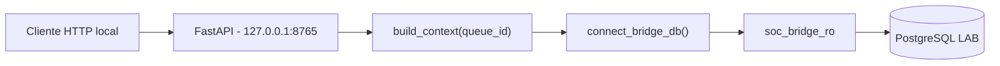

# Local PostgreSQL Bridge

**Projeto:** SOC Intelligence Orchestrator
**Ambiente:** LAB
**Implementacao:** Etapa 06
**Status:** Integracao local homologada

## Objetivo

Disponibilizar os contextos investigativos existentes no PostgreSQL
por meio de uma API FastAPI, reutilizando a logica do WF-03.

A API executa consultas de laboratorio e nao realiza:
- criacao de investigacoes;
- alteracao de filas ou versoes;
- chamadas a modelos de IA;
- envio de notificacoes;
- despacho operacional.

## Arquitetura



## Componentes

| Arquivo | Responsabilidade |
|---|---|
| src/bridge/app.py | Rotas HTTP e validacao do contrato |
| src/bridge/db.py | Conexao PostgreSQL com conta restrita |
| src/context/context_builder.py | Construcao do contexto WF-03 |
| requirements-bridge.txt | Dependencias da ponte |
| tests/test_bridge_api.py | Testes automatizados HTTP |

## Rotas

### GET /health

Retorna o estado do servico.

Observacao: esta rota nao consulta o PostgreSQL.

### GET /lab/context/{queue_id}

Consulta uma versao investigativa ja existente.

O acesso utiliza a credencial soc_bridge_ro,
obtida da variavel de ambiente SOC_BRIDGE_DB_PASSWORD.

A API nao utiliza a conta administrativa soc_lab.

## Controle de acesso PostgreSQL

O usuario soc_bridge_ro possui SELECT somente nas tabelas:

- public.investigations
- public.investigation_versions
- public.analysis_queue

Nao possui privilegios administrativos, INSERT, UPDATE
ou DELETE nas tabelas verificadas.

A configuracao default_transaction_read_only fica habilitada.

A conta restrita e as permissoes SQL constituem o controle
principal de escrita. O modo read-only e um reforco adicional.

## Credenciais

A senha e gerada localmente e armazenada fora do repositorio,
protegida por DPAPI do usuario Windows.

O codigo recebe a credencial por variavel de ambiente.

Nenhum segredo deve ser publicado no GitHub ou registrado
em arquivos de workflow.

## Homologacao local

### Queue 12

- Versao investigativa: 1
- Historica: true
- Elegivel para revisao: false

### Queue 13

- Evento: LAB-0001
- Versao investigativa: 2
- Status: READY_FOR_REVIEW
- Historica: false
- Elegivel para revisao: true
- Evidencias: 2
- Despacho operacional: false

A consulta HTTP com soc_bridge_ro foi validada,
assim como o encerramento do servidor temporario.

## Testes automatizados

Executar:

```powershell
.\.venv\Scripts\python.exe -m unittest discover -s tests -p "test_bridge_api.py" -v
```

Resultado da primeira homologacao: 7 testes aprovados.

Os testes HTTP utilizam mock para a consulta ao WF-03.
A comunicacao real com PostgreSQL foi validada
separadamente durante a homologacao local.

## Limitacoes atuais

- A API funciona exclusivamente no computador local.
- O servidor deve utilizar bind em 127.0.0.1.
- A API ainda nao possui autenticacao HTTP propria.
- A integracao com o n8n corporativo nao foi implementada.
- O E2E n8n publicado continua utilizando MOCK_SNAPSHOT.
- Nenhuma porta do PostgreSQL deve ser exposta publicamente.

Qualquer comunicacao futura com infraestrutura corporativa
depende de autorizacao e de um desenho de seguranca especifico.

## Proxima etapa

Planejar a continuidade da integracao de forma isolada,
preservando o E2E homologado e os contratos de revisao humana.
---

## Etapa 06.7 - Autenticacao HTTP Bearer

Status: homologada no laboratorio local.

### Implementacao

O modulo `src/bridge/auth.py` valida o cabecalho
`Authorization: Bearer <TOKEN>`.

O token esperado e recebido exclusivamente pela variavel
de ambiente `SOC_BRIDGE_HTTP_TOKEN`.

A comparacao utiliza `secrets.compare_digest`.

A credencial HTTP e gerada com fonte criptografica,
protegida por DPAPI do usuario Windows e mantida fora
do repositorio Git.

### Politica das rotas

| Rota | Autenticacao |
|---|---|
| GET /health | Nao exige token |
| GET /lab/context/{queue_id} | Exige Bearer valido |

O servico permanece vinculado exclusivamente a
`127.0.0.1:8765`.

A rota de contexto reutiliza o WF-03 e estabelece
a conexao PostgreSQL pela conta `soc_bridge_ro`.

### Resultado da homologacao

| Verificacao | Resultado |
|---|---|
| Health | HTTP 200 |
| Token ausente | HTTP 401 |
| Token invalido | HTTP 401 |
| Token valido | Contexto LAB recuperado |
| Evento | LAB-0001 |
| Queue ID | 13 |
| Versao | 2 |
| Evidencias | 2 |
| Consulta real ao banco | True |
| Despacho operacional | False |

Os testes automatizados da API passaram de sete
para dez casos, todos aprovados.

### Limitacoes de seguranca

Esta etapa nao implementa publicacao externa,
TLS para acesso remoto, rate limiting, autenticacao
corporativa ou integracao com o n8n empresarial.

O Bearer utilizado em HTTP local nao deve ser
transmitido por redes externas sem uma arquitetura
de transporte seguro previamente aprovada.

O endpoint `/health` informa apenas o estado do
servico e nao valida conectividade com o banco.

### Proxima etapa

Revisar os controles de seguranca restantes e o
modelo de integracao futura antes de qualquer
comunicacao com infraestrutura corporativa.
---

## Etapa 06.8 - Revisao de Seguranca Local

Status: regressao de seguranca aprovada.

Arquivo: `tests/test_bridge_security.py`.

### Controles verificados

| Controle | Resultado |
|---|---|
| Token ausente | HTTP 401 |
| Token incorreto | HTTP 401 |
| Segredo do servidor ausente | HTTP 503 |
| Queue ID nao numerico | HTTP 422 |
| Queue ID acima do limite | HTTP 422 |
| Falha interna do banco | HTTP 503 sanitizado |
| Health sem consulta ao PostgreSQL | Aprovado |

Os testes verificam que requisicoes nao autorizadas
nao executam `build_context()`.

### Resultado automatizado

17 testes aprovados:

- 10 testes funcionais da API;
- 7 testes adicionais de seguranca.

Esses testes utilizam mocks e nao modificam o PostgreSQL.

A integracao HTTP com banco real e conta `soc_bridge_ro`
foi homologada separadamente nas etapas anteriores.

### Controles ainda pendentes

- Limite configurado de concorrencia no servidor.
- Rate limiting por cliente.
- Definicao de transporte seguro para integracao remota.
- Autorizacao formal antes de qualquer uso com n8n corporativo.

O servico permanece exclusivo do LAB local, vinculado
a `127.0.0.1`, sem despacho operacional.
