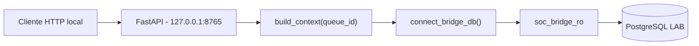

# Local PostgreSQL Bridge

**Projeto:** SOC Intelligence Orchestrator
**Ambiente:** LAB
**Implementacao:** Etapa 06
**Status:** Integracao local homologada

## Objetivo

Disponibilizar os contextos investigativos existentes no PostgreSQL
por meio de uma API FastAPI, reutilizando a logica do WF-03.

A API executa consultas de laboratorio e nao realiza:
- criacao de investigacoes;
- alteracao de filas ou versoes;
- chamadas a modelos de IA;
- envio de notificacoes;
- despacho operacional.

## Arquitetura



## Componentes

| Arquivo | Responsabilidade |
|---|---|
| src/bridge/app.py | Rotas HTTP e validacao do contrato |
| src/bridge/db.py | Conexao PostgreSQL com conta restrita |
| src/context/context_builder.py | Construcao do contexto WF-03 |
| requirements-bridge.txt | Dependencias da ponte |
| tests/test_bridge_api.py | Testes automatizados HTTP |

## Rotas

### GET /health

Retorna o estado do servico.

Observacao: esta rota nao consulta o PostgreSQL.

### GET /lab/context/{queue_id}

Consulta uma versao investigativa ja existente.

O acesso utiliza a credencial soc_bridge_ro,
obtida da variavel de ambiente SOC_BRIDGE_DB_PASSWORD.

A API nao utiliza a conta administrativa soc_lab.

## Controle de acesso PostgreSQL

O usuario soc_bridge_ro possui SELECT somente nas tabelas:

- public.investigations
- public.investigation_versions
- public.analysis_queue

Nao possui privilegios administrativos, INSERT, UPDATE
ou DELETE nas tabelas verificadas.

A configuracao default_transaction_read_only fica habilitada.

A conta restrita e as permissoes SQL constituem o controle
principal de escrita. O modo read-only e um reforco adicional.

## Credenciais

A senha e gerada localmente e armazenada fora do repositorio,
protegida por DPAPI do usuario Windows.

O codigo recebe a credencial por variavel de ambiente.

Nenhum segredo deve ser publicado no GitHub ou registrado
em arquivos de workflow.

## Homologacao local

### Queue 12

- Versao investigativa: 1
- Historica: true
- Elegivel para revisao: false

### Queue 13

- Evento: LAB-0001
- Versao investigativa: 2
- Status: READY_FOR_REVIEW
- Historica: false
- Elegivel para revisao: true
- Evidencias: 2
- Despacho operacional: false

A consulta HTTP com soc_bridge_ro foi validada,
assim como o encerramento do servidor temporario.

## Testes automatizados

Executar:

```powershell
.\.venv\Scripts\python.exe -m unittest discover -s tests -p "test_bridge_api.py" -v
```

Resultado da primeira homologacao: 7 testes aprovados.

Os testes HTTP utilizam mock para a consulta ao WF-03.
A comunicacao real com PostgreSQL foi validada
separadamente durante a homologacao local.

## Limitacoes atuais

- A API funciona exclusivamente no computador local.
- O servidor deve utilizar bind em 127.0.0.1.
- A API ainda nao possui autenticacao HTTP propria.
- A integracao com o n8n corporativo nao foi implementada.
- O E2E n8n publicado continua utilizando MOCK_SNAPSHOT.
- Nenhuma porta do PostgreSQL deve ser exposta publicamente.

Qualquer comunicacao futura com infraestrutura corporativa
depende de autorizacao e de um desenho de seguranca especifico.

## Proxima etapa

Planejar a continuidade da integracao de forma isolada,
preservando o E2E homologado e os contratos de revisao humana.